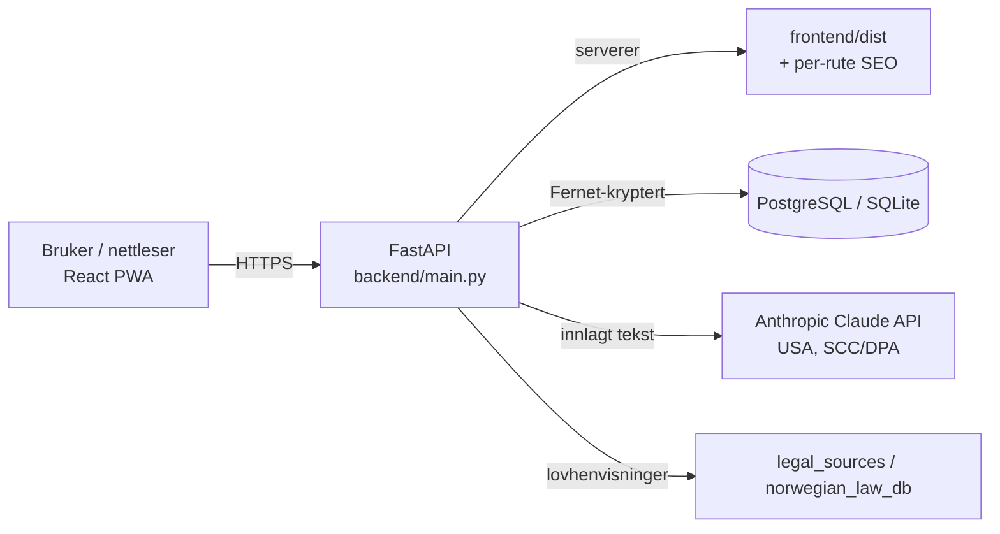

# Arkitektur – RettBot+

Teknisk oversikt over hvordan RettBot+ er bygd. Sammen med [README.md](README.md)
og [TODO_HELENE.md](TODO_HELENE.md) er dette kilden som stemmer med koden i dag.

## Overordnet

En **monolitt**: samme FastAPI-app er både REST-API og statisk vert for den
ferdigbygde React-appen. Ingen separat frontend-server i prod.

## Backend (`backend/`)

| Fil | Ansvar |
|---|---|
| `main.py` | App-init, alle API-endepunkter, auth, DB-init, SPA-servering. (Stor fil – se «teknisk gjeld».) |
| `seo.py` | Injiserer per-rute `<title>`/meta/OG/canonical + crawlbart innhold i index.html |
| `db.py` | Abstraksjon SQLite (dev) / PostgreSQL (prod): oversetter `?`→`%s`, `RETURNING`, autoincrement |
| `security_enhancements.py` | `RateLimiter` (in-memory), passordstyrke, CSP/security headers, klient-IP |
| `ai_engine/claude_integration.py` | `ClaudeEngine`: bevisanalyse, research, forsvarsstrategi, dokument, korrupsjon, chat + «realisme/ærlighet»-føringer |
| `ai_engine/norwegian_law_db.py` | Statisk utvalg lovtekst brukt som kontekst til AI |
| `legal_sources.py` | Kuraterte Lovdata-lenker + integrasjonspunkt for rettspraksis (env-gated) |
| `start.py`, `Dockerfile`, `railway.toml`, `requirements.txt` | Oppstart og deploy |

### Auth-flyt
JWT (PyJWT), passord hashet med bcrypt. `get_current_user` dekoder token på hvert
kall. AI-endepunktene bruker i tillegg `ai_rate_limit` (auth + per-bruker takst).
Token lagres i dag i **localStorage** på klienten (se teknisk gjeld / sikkerhet).

### AI-flyt
`ClaudeEngine` bygger en systemprompt med `REALISME_OG_ANSVAR`-føringer (si ifra om
svak sak / utløpt frist), henter relevant lovtekst og autoritative Lovdata-lenker,
og streamer svaret fra Claude (`messages.stream()` → `get_final_message()`).

## Frontend (`frontend/src/`)

| Område | Filer |
|---|---|
| Ruting | `App.tsx` (åpne ruter + `ProtectedRoute` for AI-verktøy/konto) |
| Auth | `contexts/AuthContext.tsx` |
| AI-verktøy (krever login) | LegalResearch, DefenseStrategy, DocumentGenerator, EvidenceAnalysis, CorruptionAssessment, PenaltiesLookup, RightsProtection, LegalChat, EvidenceUpload |
| Åpne verktøy/innhold | Dashboard, Eskalering (Hvor klager du), Maler, Fristkalkulator, Innsynskrav, KomIGang, Eksempler, Veivisere/Veiviser |
| Konto | MinKonto, MyCases, Tidslinje |
| Auth-sider | Login, Register, ForgotPassword, ResetPassword |
| Juridisk | Personvern, Vilkar |
| Komponenter | AiDisclaimer, ConfidenceBadge, FeedbackWidget, DownloadSaksmappe, NesteSteg, SaveToCase, ProtectedRoute, TopNav, SiteFooter, TitleManager, CookieConsent |
| Data | `data/templates.ts`, `data/escalation.ts`, `data/veivisere.ts` |

Design: Tailwind, «offentlig-stil» (primary/slate), komponentklasser
`card-professional`, `header-professional`, `btn-primary`. PWA via vite-plugin-pwa.
Dev: Vite på `:3000` proxier `/api` til backend på `:8000`.

## Datamodell (tabeller)

| Tabell | Kryptert | Innhold |
|---|---|---|
| `users` | passord hashet | e-post, navn, passord_hash |
| `cases` | `encrypted_data` | saker |
| `documents` / `saved_documents` | innhold kryptert | opplastede/lagrede dokumenter |
| `evidence` | innhold kryptert | bevis (metadata i klartekst) |
| `timeline_events` | `encrypted_data` | tidslinje (dato i klartekst for sortering) |
| `password_reset_tokens` | token hashet | reset-flyt |
| `feedback` | – | anonym nytte-tilbakemelding (ingen PII) |

Saksinnhold krypteres med **Fernet på applikasjonslaget** før lagring.

## SEO
Serveren injiserer per-rute metadata + et lite crawlbart innholdsblokk i `#root`
som React overskriver når JS kjører. Offentlige sider er `index`, gated/auth-sider
`noindex`. Sitemap i `frontend/public/sitemap.xml`.

## Kjent teknisk gjeld (ærlig)
Fanget opp i ekstern gjennomgang, dokumentert her så det ikke glemmes:
- `main.py` er stor og bør splittes i `APIRouter`-moduler.
- `db.py` er en egen abstraksjon; SQLAlchemy 2.0 + Alembic ville vært mer robust.
- In-memory `RateLimiter` deles ikke mellom flere workers/instanser (bør til Redis,
  eller kjør én web-worker inntil videre).
- Fernet krypterer hele felter → kan ikke søke/indeksere på saksinnhold i DB.
- Mangler automatiserte «evals» for juridisk presisjon (frister, paragrafer).
- Ingen PII-anonymisering før tekst sendes til Anthropic.
- SEO-injeksjonen leser og bygger HTML per request (bør caches).
Se README/TODO for status og prioritering.
